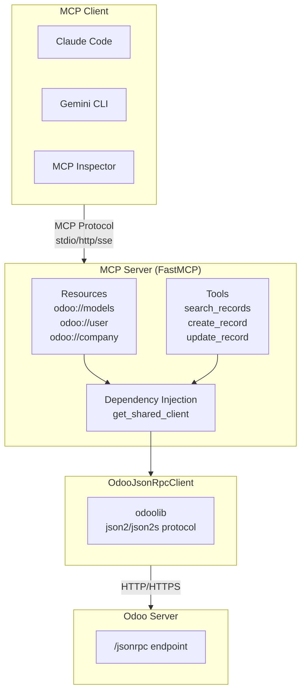

# Odoo 19 MCP Server (JSON-2 API)

* [Youtube Tutorial - MCP Server 自己做！Odoo 19 + FastMCP 完整開發教學](https://youtu.be/JhAudIIII3M)

Odoo 19 MCP Server，使用 JSON-2 API 連線。

本專案基於 [Odoo 19 JSON-2 API 完整使用指南](https://github.com/twtrubiks/odoo-demo-addons-tutorial/blob/19.0/odoo-json2-client/README.md) 開發。


## 技術棧

- **Python**: 3.13
- **FastMCP**: 2.14.3
- **odoo-client-lib**: 2.0.0 (JSON-2 API)

## 架構



## MCP 核心概念

### Resources vs Tools

| 特性 | Resources | Tools |
|------|-----------|-------|
| **用途** | 提供上下文資訊 | 執行操作/動作 |
| **觸發** | 客戶端控制（如 Claude Code） | LLM 自動決定呼叫 |
| **參數** | 無（或 URI 參數） | 有（需 LLM 生成） |
| **類比** | 員工手冊（背景知識） | 工具箱（按需使用） |
| **HTTP 類比** | GET（讀取） | POST/PUT/DELETE（操作） |

**Resources** - 動態上下文，LLM 一開始就知道的背景資訊：

```
odoo://user     → "我是誰"
odoo://company  → "我在哪間公司"
odoo://models   → "有哪些模型可用"
```

**Tools** - 需要時才呼叫的操作：

```
search_records(model="res.partner", domain=[...])  → 搜尋
create_record(model="sale.order", values={...})    → 建立
```

### 為什麼不用 Default Prompt？

| 方式 | Default Prompt | Resource |
|------|----------------|----------|
| 資料來源 | 寫死在程式碼 | 即時從 Odoo 查詢 |
| 更新時機 | 部署時 | 每次連線時 |
| 換用戶登入 | 資訊錯誤 | 自動正確 |

```python
# ❌ Default Prompt（寫死）
SYSTEM_PROMPT = "當前用戶: Admin"  # 換人登入就錯了

# ✅ Resource（動態）
@mcp.resource("odoo://user")
def get_current_user():
    return client.read("res.users", [uid])  # 即時查詢
```

**結論**：Resource 是「動態的上下文」，不是靜態文字。

> 參考：[MCP Resources](https://modelcontextprotocol.io/docs/concepts/resources) | [MCP Tools](https://modelcontextprotocol.io/docs/concepts/tools)

## 環境變數

| 變數 | 說明 | 預設值 |
|------|------|--------|
| `ODOO_URL` | Odoo 伺服器 URL | `http://localhost:8069` |
| `ODOO_DATABASE` | 資料庫名稱 | - |
| `ODOO_API_KEY` | API Key 認證 | - |
| `READONLY_MODE` | 唯讀模式（禁止寫入操作） | `false` |

建立 `.env` 檔案：

```bash
cp .env.example .env
```

## 安裝

```bash
pip install -r requirements.txt
```

## 啟動方式

### 開發模式（MCP Inspector）

```bash
fastmcp dev odoo_mcp_server.py
```

## 傳輸模式（Transport）

本專案支援三種 MCP 傳輸模式：

| 模式 | 說明 | 適用情境 |
|------|------|----------|
| `stdio` | 標準輸入輸出（預設） | Claude Desktop、Cursor IDE、本機開發 |
| `http` | HTTP 協定 | 遠端服務、n8n、Web 應用整合 |
| `sse` | Server-Sent Events（已棄用） | 向下相容舊版 Client |

### stdio vs HTTP/SSE：算力位置

兩種模式的關鍵差異在於「誰來啟動 MCP Server」以及「算力在哪裡執行」：

**stdio 模式（本機算力）**

```
┌─────────────────────────────────────┐
│            你的電腦 💻               │
│                                     │
│  Claude Desktop ──> MCP Server      │
│                     (使用本機算力)   │
└─────────────────────────────────────┘
```

- Client（如 Claude Desktop）啟動 MCP Server 作為子進程
- MCP Server 使用你電腦的 CPU/RAM
- Server 隨 Client 啟動/關閉

**HTTP/SSE 模式（遠端算力）**

```
┌──────────────┐         ┌──────────────────┐
│   你的電腦    │         │     雲端 ☁️       │
│              │         │                  │
│Claude Desktop│ ──網路──>│   MCP Server     │
│  (輕量)      │         │  (使用雲端算力)   │
└──────────────┘         └──────────────────┘
```

- MCP Server 獨立運行在雲端/遠端主機
- 多個 Client 可同時連線同一個 Server
- 適合團隊共用、n8n 整合、正式環境

### 啟動不同模式

```bash
# stdio 模式（預設）
python odoo_mcp_server.py

# HTTP 模式
python odoo_mcp_server.py --transport http --host 0.0.0.0 --port 8000

# SSE 模式（已棄用，建議使用 HTTP）
python odoo_mcp_server.py --transport sse --host 0.0.0.0 --port 8000
```

### 雲端部署（HTTP 模式）

Docker Compose 範例：

```yaml
services:
  odoo-mcp:
    build: .
    ports:
      - "8000:8000"
    environment:
      - ODOO_URL=http://odoo:8069
      - ODOO_DATABASE=odoo19
      - ODOO_API_KEY=your_api_key_here
    command: ["python", "odoo_mcp_server.py", "--transport", "http", "--host", "0.0.0.0", "--port", "8000"]
    restart: unless-stopped
```

Client 設定(claude)改用 URL 連線：

```sh
claude mcp add --transport http odoo-mcp https://your-cloud-server.com:8000/mcp
```

<details>
<summary><b>手動設定 JSON（加到 `~/.claude.json`）</b></summary>

```json
{
  "mcpServers": {
    "odoo-mcp": {
      "type": "http",
      "url": "https://your-cloud-server.com:8000/mcp"
    }
  }
}
```

</details>

## MCP Resources

| URI | 說明 |
|-----|------|
| `odoo://models` | 列出所有模型 |
| `odoo://model/{model_name}` | 取得模型欄位定義 |
| `odoo://record/{model_name}/{record_id}` | 取得單筆記錄 |
| `odoo://user` | 當前登入用戶資訊 |
| `odoo://company` | 當前用戶所屬公司資訊 |

## MCP Tools

| Tool | 說明 | 唯讀 |
|------|------|------|
| `list_models` | 列出/搜尋可用模型 | Yes |
| `get_fields` | 取得模型欄位定義 | Yes |
| `search_records` | 搜尋記錄 | Yes |
| `count_records` | 計數記錄 | Yes |
| `read_records` | 讀取指定 ID 記錄 | Yes |
| `create_record` | 建立記錄 | No |
| `update_record` | 更新記錄 | No |
| `delete_record` | 刪除記錄 | No |
| `execute_method` | 執行模型方法 | Depends |

## Claude Code MCP 設定

設定檔位於 `~/.claude.json`：

### 本機執行

```sh
claude mcp add odoo-mcp-server -- python odoo_mcp_server.py
```

<details>
<summary><b>手動設定 JSON</b></summary>

```json
{
  "mcpServers": {
    "odoo-mcp-server": {
      "command": "/bin/python",
      "args": [
        "odoo_mcp_server.py"
      ]
    }
  }
}
```

</details>

### Docker（host.docker.internal）

適用於 Odoo 執行在本機的情況：

```sh
claude mcp add odoo-mcp-server -- docker run -i --rm --add-host=host.docker.internal:host-gateway -e ODOO_URL=http://host.docker.internal:8069 -e ODOO_DATABASE=odoo19 -e ODOO_API_KEY=your_api_key_here odoo-mcp-server
```

<details>
<summary><b>手動設定 JSON</b></summary>

```json
{
  "mcpServers": {
    "odoo-mcp-server": {
      "command": "docker",
      "args": [
        "run",
        "-i",
        "--rm",
        "--add-host=host.docker.internal:host-gateway",
        "-e",
        "ODOO_URL=http://host.docker.internal:8069",
        "-e",
        "ODOO_DATABASE=odoo19",
        "-e",
        "ODOO_API_KEY=your_api_key_here",
        "odoo-mcp-server"
      ]
    }
  }
}
```

</details>

### Docker（host network）

使用主機網路模式：

```sh
claude mcp add odoo-mcp-server -- docker run -i --rm --network host -e ODOO_URL=http://localhost:8069 -e ODOO_DATABASE=odoo19 -e ODOO_API_KEY=your_api_key_here odoo-mcp-server
```

<details>
<summary><b>手動設定 JSON</b></summary>

```json
{
  "mcpServers": {
    "odoo-mcp-server": {
      "command": "docker",
      "args": [
        "run",
        "-i",
        "--rm",
        "--network",
        "host",
        "-e",
        "ODOO_URL=http://localhost:8069",
        "-e",
        "ODOO_DATABASE=odoo19",
        "-e",
        "ODOO_API_KEY=your_api_key_here",
        "odoo-mcp-server"
      ]
    }
  }
}
```

</details>

### Docker（遠端 Odoo）

```sh
claude mcp add odoo-mcp-server -- docker run -i --rm -e ODOO_URL=https://example.com/ -e ODOO_DATABASE=odoo19 -e ODOO_API_KEY=your_api_key_here odoo-mcp-server
```

<details>
<summary><b>手動設定 JSON</b></summary>

```json
{
  "mcpServers": {
    "odoo-mcp-server": {
      "command": "docker",
      "args": [
        "run",
        "-i",
        "--rm",
        "-e",
        "ODOO_URL=https://example.com/",
        "-e",
        "ODOO_DATABASE=odoo19",
        "-e",
        "ODOO_API_KEY=your_api_key_here",
        "odoo-mcp-server"
      ]
    }
  }
}
```

</details>

## Docker 建置

```bash
docker build -t odoo-mcp-server .
```

## Gemini MCP 設定

```sh
gemini mcp add --scope user odoo-mcp docker -- run -i --rm --add-host=host.docker.internal:host-gateway -e ODOO_URL=http://host.docker.internal:8069 -e ODOO_DATABASE=odoo19 -e ODOO_API_KEY=your_api_key_here odoo-mcp-server
```

<details>
<summary><b>手動設定 JSON（加到 `~/.gemini/settings.json`）</b></summary>

```json
{
  "mcpServers": {
    "odoo-mcp": {
      "command": "docker",
      "args": [
        "run",
        "-i",
        "--rm",
        "--add-host=host.docker.internal:host-gateway",
        "-e",
        "ODOO_URL=http://host.docker.internal:8069",
        "-e",
        "ODOO_DATABASE=odoo19",
        "-e",
        "ODOO_API_KEY=your_api_key_here",
        "odoo-mcp-server"
      ]
    }
  }
}
```

</details>

## 唯讀模式

設定 `READONLY_MODE=true` 可禁止所有寫入操作（create、write、unlink、copy），適用於生產環境查詢。

## License

Apache 2.0
