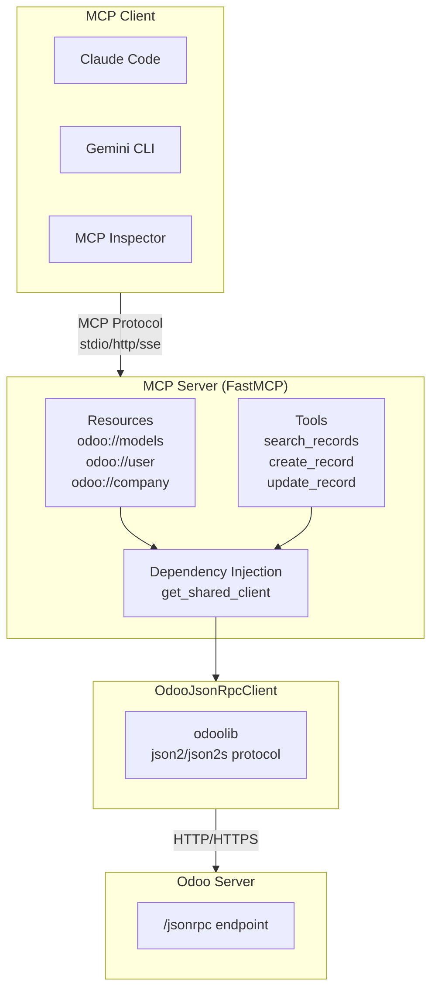

# Odoo 19 MCP Server (JSON-2 API)

[](https://glama.ai/mcp/servers/twtrubiks/odoo19-mcp-server)

[](LICENSE)
[](https://www.python.org/)
[](https://github.com/twtrubiks/odoo19-mcp-server/stargazers)
[](https://github.com/twtrubiks/odoo19-mcp-server/commits/main)
[](https://github.com/punkpeye/awesome-mcp-servers)

**支援的 MCP Client**

[](#claude-code)
[](#gemini-cli)
[](#antigravity-cli)
[](#openclaw)
[](#codex-cli)

* [Youtube Tutorial - MCP Server 自己做！Odoo 19 + FastMCP 完整開發教學](https://youtu.be/JhAudIIII3M)

Odoo 19 MCP Server，使用 JSON-2 API 連線。

本專案基於 [Odoo 19 JSON-2 API 完整使用指南](https://github.com/twtrubiks/odoo-demo-addons-tutorial/blob/19.0/odoo-json2-client/README.md) 開發。


## 技術棧

- **Python**: 3.13
- **FastMCP**: >=3.0.0,<4.0.0
- **odoo-client-lib**: 2.0.1 (JSON-2 API)

## 架構


```mermaid
flowchart TB
    subgraph Client["MCP Client"]
        CC[Claude Code]
        GC[Gemini CLI]
        MI[MCP Inspector]
    end

    subgraph Server["MCP Server (FastMCP)"]
        R[Resources<br/>odoo://models<br/>odoo://user<br/>odoo://company]
        T[Tools<br/>search_records<br/>create_record<br/>update_record]
        DI[Dependency Injection<br/>get_shared_client]
    end

    subgraph RPC["OdooJsonRpcClient"]
        OL[odoolib<br/>json2/json2s protocol]
    end

    subgraph Odoo["Odoo Server"]
        EP["/jsonrpc endpoint"]
    end

    Client -->|MCP Protocol<br/>stdio/http/sse| Server
    R --> DI
    T --> DI
    DI --> RPC
    RPC -->|HTTP/HTTPS| Odoo
```

## MCP 核心概念

### Resources vs Tools

| 特性 | Resources | Tools |
|------|-----------|-------|
| **用途** | 提供上下文資訊 | 執行操作/動作 |
| **觸發** | 客戶端控制（如 Claude Code） | LLM 自動決定呼叫 |
| **參數** | 無（或 URI 參數） | 有（需 LLM 生成） |
| **類比** | 員工手冊（背景知識） | 工具箱（按需使用） |
| **HTTP 類比** | GET（讀取） | POST/PUT/DELETE（操作） |

**Resources** - 動態上下文，LLM 一開始就知道的背景資訊：

```
odoo://user     → "我是誰"
odoo://company  → "我在哪間公司"
odoo://models   → "有哪些模型可用"
```

**Tools** - 需要時才呼叫的操作：

```
search_records(model="res.partner", domain=[...])  → 搜尋
create_record(model="sale.order", values={...})    → 建立
```

### 為什麼不用 Default Prompt？

| 方式 | Default Prompt | Resource |
|------|----------------|----------|
| 資料來源 | 寫死在程式碼 | 即時從 Odoo 查詢 |
| 更新時機 | 部署時 | 每次連線時 |
| 換用戶登入 | 資訊錯誤 | 自動正確 |

```python
# ❌ Default Prompt（寫死）
SYSTEM_PROMPT = "當前用戶: Admin"  # 換人登入就錯了

# ✅ Resource（動態）
@mcp.resource("odoo://user")
def get_current_user():
    return client.read("res.users", [uid])  # 即時查詢
```

**結論**：Resource 是「動態的上下文」，不是靜態文字。

> 參考：[MCP Resources](https://modelcontextprotocol.io/docs/concepts/resources) | [MCP Tools](https://modelcontextprotocol.io/docs/concepts/tools)

## 環境變數

| 變數 | 說明 | 預設值 |
|------|------|--------|
| `ODOO_URL` | Odoo 伺服器 URL | `http://localhost:8069` |
| `ODOO_DATABASE` | 資料庫名稱 | - |
| `ODOO_API_KEY` | API Key 認證 | - |
| `READONLY_MODE` | 唯讀模式（禁止寫入操作） | `false` |

建立 `.env` 檔案：

```bash
cp .env.example .env
```

## 安裝

```bash
pip install -r requirements.txt
```

## 啟動方式

### 開發模式（MCP Inspector）

```bash
fastmcp dev inspector odoo_mcp_server.py
```

## 傳輸模式（Transport）

本專案支援三種 MCP 傳輸模式：

| 模式 | 說明 | 適用情境 |
|------|------|----------|
| `stdio` | 標準輸入輸出（預設） | Claude Desktop、Cursor IDE、本機開發 |
| `http` | HTTP 協定 | 遠端服務、n8n、Web 應用整合 |
| `sse` | Server-Sent Events（已棄用） | 向下相容舊版 Client |

### stdio vs HTTP/SSE：算力位置

兩種模式的關鍵差異在於「誰來啟動 MCP Server」以及「算力在哪裡執行」：

**stdio 模式（本機算力）**

```
┌─────────────────────────────────────┐
│            你的電腦 💻               │
│                                     │
│  Claude Desktop ──> MCP Server      │
│                     (使用本機算力)   │
└─────────────────────────────────────┘
```

- Client（如 Claude Desktop）啟動 MCP Server 作為子進程
- MCP Server 使用你電腦的 CPU/RAM
- Server 隨 Client 啟動/關閉

**HTTP/SSE 模式（遠端算力）**

```
┌──────────────┐         ┌──────────────────┐
│   你的電腦    │         │     雲端 ☁️       │
│              │         │                  │
│Claude Desktop│ ──網路──>│   MCP Server     │
│  (輕量)      │         │  (使用雲端算力)   │
└──────────────┘         └──────────────────┘
```

- MCP Server 獨立運行在雲端/遠端主機
- 多個 Client 可同時連線同一個 Server
- 適合團隊共用、n8n 整合、正式環境

### 啟動不同模式

```bash
# stdio 模式（預設）
python odoo_mcp_server.py

# HTTP 模式
python odoo_mcp_server.py --transport http --host 0.0.0.0 --port 8000

# SSE 模式（已棄用，建議使用 HTTP）
python odoo_mcp_server.py --transport sse --host 0.0.0.0 --port 8000
```

### 雲端部署（HTTP 模式）

專案提供 `docker-compose.example.yml` 範本，複製後修改即可使用：

```bash
cp .env.example .env                                  # 填入 ODOO_URL / ODOO_DATABASE / ODOO_API_KEY
cp docker-compose.example.yml docker-compose.yml      # 依需求調整
docker compose up -d
```

範本內容

```yaml
volumes:
  shared-uploads:

services:
  odoo-mcp:
    build: .
    command: ["python", "odoo_mcp_server.py", "--transport", "http", "--host", "0.0.0.0", "--port", "8000"]
    # 對外暴露 port 8000（host 端 client 可直接連 http://localhost:8000/mcp）。
    # 若只需 Docker 內網存取（例如 client 也在同一個 compose 裡），可整段移除 ports。
    ports:
      - "8000:8000"
    environment:
      - ODOO_URL=${ODOO_URL}
      - ODOO_DATABASE=${ODOO_DATABASE}
      - ODOO_API_KEY=${ODOO_API_KEY}
      - READONLY_MODE=${READONLY_MODE:-false}
    volumes:
      - shared-uploads:/shared   # 圖片傳遞通道；對應 Dockerfile 預建的 /shared/uploads
    restart: unless-stopped
```

> **圖片 / 附件傳遞**：`add_attachment` 的 `file_path` 模式會從 `/shared/uploads/` 讀檔上傳到 Odoo，避免大量 base64 佔用 LLM output token。
>
> ⚠️ `shared-uploads` 是 Docker named volume，只能在「同一台 Docker host」共享。client 與 server **跨機器**時無法共用此 volume，只能改用 `base64_data` 模式傳檔。詳見 `docker-compose.example.yml` 註解。

```sh
claude mcp add --transport http odoo-mcp https://your-cloud-server.com:8000/mcp
```

<details>
<summary><b>手動設定 JSON（加到 `~/.claude.json`）</b></summary>

```json
{
  "mcpServers": {
    "odoo-mcp": {
      "type": "http",
      "url": "https://your-cloud-server.com:8000/mcp"
    }
  }
}
```

</details>

## MCP Resources

| URI | 說明 |
|-----|------|
| `odoo://models` | 列出所有模型 |
| `odoo://model/{model_name}` | 取得模型欄位定義 |
| `odoo://record/{model_name}/{record_id}` | 取得單筆記錄 |
| `odoo://user` | 當前登入用戶資訊 |
| `odoo://company` | 當前用戶所屬公司資訊 |

## MCP Tools

| Tool | 說明 | 唯讀 |
|------|------|------|
| `list_models` | 列出/搜尋可用模型 | Yes |
| `get_fields` | 取得模型欄位定義 | Yes |
| `search_records` | 搜尋記錄 | Yes |
| `count_records` | 計數記錄 | Yes |
| `read_records` | 讀取指定 ID 記錄 | Yes |
| `create_record` | 建立記錄 | No |
| `update_record` | 更新記錄 | No |
| `delete_record` | 刪除記錄（需二次確認） | No |
| `execute_method` | 執行模型方法 | Depends |

## Docker 建置

部分 client 的 Docker 設定（Claude Code / Gemini 的 Docker 版本）需要先建置本機映像檔：

```bash
docker build -t odoo-mcp-server .
```

## MCP Client 設定

本專案支援以下 MCP Client，各自的完整設定步驟見對應章節：

| Client | 加入方式 | 設定檔 |
|--------|----------|--------|
| [Claude Code](#claude-code) | `claude mcp add` | `~/.claude.json` |
| [Gemini CLI](#gemini-cli) | `gemini mcp add` | `~/.gemini/settings.json` |
| [Antigravity CLI](#antigravity-cli) | 手動編輯 | `~/.gemini/config/mcp_config.json` |
| [OpenClaw](#openclaw) | `openclaw mcp set` | OpenClaw config |
| [Codex CLI](#codex-cli) | `codex mcp add` + 手動編輯 | `~/.codex/config.toml` |

### Claude Code

設定檔位於 `~/.claude.json`：

#### 本機執行

```sh
claude mcp add odoo-mcp-server -- python odoo_mcp_server.py
```

<details>
<summary><b>手動設定 JSON</b></summary>

```json
{
  "mcpServers": {
    "odoo-mcp-server": {
      "command": "/bin/python",
      "args": [
        "odoo_mcp_server.py"
      ]
    }
  }
}
```

</details>

#### Docker（host.docker.internal）

適用於 Odoo 執行在本機的情況：

```sh
claude mcp add odoo-mcp-server -- docker run -i --rm --add-host=host.docker.internal:host-gateway -e ODOO_URL=http://host.docker.internal:8069 -e ODOO_DATABASE=odoo19 -e ODOO_API_KEY=your_api_key_here odoo-mcp-server
```

<details>
<summary><b>手動設定 JSON</b></summary>

```json
{
  "mcpServers": {
    "odoo-mcp-server": {
      "command": "docker",
      "args": [
        "run",
        "-i",
        "--rm",
        "--add-host=host.docker.internal:host-gateway",
        "-e",
        "ODOO_URL=http://host.docker.internal:8069",
        "-e",
        "ODOO_DATABASE=odoo19",
        "-e",
        "ODOO_API_KEY=your_api_key_here",
        "odoo-mcp-server"
      ]
    }
  }
}
```

</details>

#### Docker（host network）

使用主機網路模式：

```sh
claude mcp add odoo-mcp-server -- docker run -i --rm --network host -e ODOO_URL=http://localhost:8069 -e ODOO_DATABASE=odoo19 -e ODOO_API_KEY=your_api_key_here odoo-mcp-server
```

<details>
<summary><b>手動設定 JSON</b></summary>

```json
{
  "mcpServers": {
    "odoo-mcp-server": {
      "command": "docker",
      "args": [
        "run",
        "-i",
        "--rm",
        "--network",
        "host",
        "-e",
        "ODOO_URL=http://localhost:8069",
        "-e",
        "ODOO_DATABASE=odoo19",
        "-e",
        "ODOO_API_KEY=your_api_key_here",
        "odoo-mcp-server"
      ]
    }
  }
}
```

</details>

#### Docker（遠端 Odoo）

```sh
claude mcp add odoo-mcp-server -- docker run -i --rm -e ODOO_URL=https://example.com/ -e ODOO_DATABASE=odoo19 -e ODOO_API_KEY=your_api_key_here odoo-mcp-server
```

<details>
<summary><b>手動設定 JSON</b></summary>

```json
{
  "mcpServers": {
    "odoo-mcp-server": {
      "command": "docker",
      "args": [
        "run",
        "-i",
        "--rm",
        "-e",
        "ODOO_URL=https://example.com/",
        "-e",
        "ODOO_DATABASE=odoo19",
        "-e",
        "ODOO_API_KEY=your_api_key_here",
        "odoo-mcp-server"
      ]
    }
  }
}
```

</details>

### Gemini CLI

```sh
gemini mcp add --scope user odoo-mcp docker -- run -i --rm --add-host=host.docker.internal:host-gateway -e ODOO_URL=http://host.docker.internal:8069 -e ODOO_DATABASE=odoo19 -e ODOO_API_KEY=your_api_key_here odoo-mcp-server
```

<details>
<summary><b>手動設定 JSON（加到 `~/.gemini/settings.json`）</b></summary>

```json
{
  "mcpServers": {
    "odoo-mcp": {
      "command": "docker",
      "args": [
        "run",
        "-i",
        "--rm",
        "--add-host=host.docker.internal:host-gateway",
        "-e",
        "ODOO_URL=http://host.docker.internal:8069",
        "-e",
        "ODOO_DATABASE=odoo19",
        "-e",
        "ODOO_API_KEY=your_api_key_here",
        "odoo-mcp-server"
      ]
    }
  }
}
```

</details>

### Antigravity CLI

> 自 2026/6/18 起個人版 Gemini CLI 停止服務，改用 [Antigravity CLI](https://antigravity.google/)。目前 **沒有** `mcp add` 子指令，需手動編輯設定檔。

設定檔路徑為 `~/.gemini/config/mcp_config.json`（Antigravity CLI / IDE / SDK 共用，等同 Gemini CLI 的 `--scope user`）。

JSON 格式與上方 Gemini CLI 設定相同。

設定後進入 Antigravity CLI 以 `/mcp` 指令重新載入，並確認連線狀態。

### OpenClaw

OpenClaw 透過 CLI 管理 MCP server，設定會寫入 `mcp.servers.<name>`。

> `/mcp` 指令為 **owner-only 且預設關閉**，需以 `commands.mcp: true` 開啟才能在 chat session 中使用。

#### 步驟 1：註冊 MCP server

```sh
# 請將 your-server-ip 換成你的 MCP server 位址
openclaw mcp set odoo-mcp '{"type":"http","url":"http://your-server-ip:8000/mcp"}'
```

<details>
<summary><b>手動設定 JSON（寫入 OpenClaw 設定的 `mcp.servers`）</b></summary>

OpenClaw 會自動正規化設定，把 `type:"http"` 轉成 `transport:"streamable-http"` 後存入：

```json
{
  "mcp": {
    "servers": {
      "odoo-mcp": {
        "url": "http://your-server-ip:8000/mcp",
        "transport": "streamable-http"
      }
    }
  }
}
```

</details>

#### 步驟 2：開啟 `/mcp` 指令

```sh
openclaw config set commands.mcp true
```

#### 步驟 3：重啟 Gateway 套用設定

```sh
openclaw gateway restart
```

> 若想等進行中的工作排空再重啟，可改用 `openclaw gateway restart --safe`。

#### 驗證

```sh
# server 是否註冊成功
openclaw mcp list
openclaw mcp show odoo-mcp

# /mcp 開關狀態（應回傳 true）
openclaw config get commands.mcp
```

完成後請**開一個新的 chat session（或硬重整 dashboard），再輸入 `/mcp`** 確認 `odoo-mcp` 連線狀態。

### Codex CLI

> Codex 的 `codex mcp add` **只支援 stdio（`command` / `args`）**，並不支援 url（streamable HTTP）形式的遠端 server。因此要連雲端 HTTP 模式的 MCP server，需先用佔位指令建立設定，再手動編輯 `~/.codex/config.toml`。

```sh
codex mcp add odoo-mcp -- echo placeholder
```

<details>
<summary><b>手動設定 TOML（修改 `~/.codex/config.toml`）</b></summary>

`codex mcp add` 產生的佔位設定：

```toml
[mcp_servers.odoo-mcp]
command = "echo"
args = ["placeholder"]
```

手動改為 url（streamable HTTP）：

```toml
[mcp_servers.odoo-mcp]
url = "https://your-cloud-server.com:8000/mcp"
```

> 若遠端 server 需要認證，可額外加上 `bearer_token_env_var = "ODOO_MCP_TOKEN"` 或自訂 `http_headers`。

</details>

## 安全機制

### 唯讀模式

設定 `READONLY_MODE=true` 啟用唯讀模式，適用於生產環境查詢：

- 寫入工具（`create_record`、`update_record`、`delete_record`、`execute_method`）透過 FastMCP tags 直接隱藏，LLM 不會看到這些工具

### 刪除二次確認

`delete_record` 內建 confirm 機制，LLM 必須先以 `confirm=False` 呼叫取得確認提示，經使用者同意後才能以 `confirm=True` 執行刪除。

## 健康檢查

HTTP/SSE transport 模式下提供 `/health` 端點：

```bash
curl http://localhost:8000/health
# {"status": "healthy", "service": "odoo-mcp-server", "version": "1.0.0"}
```

適用於 Docker healthcheck、Kubernetes probe、load balancer 探活。stdio 模式下不影響。

## License

Apache 2.0
